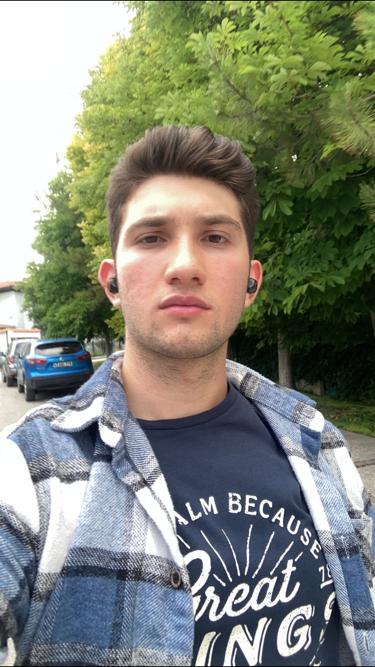

<link rel="stylesheet" href="https://cdnjs.cloudflare.com/ajax/libs/font-awesome/5.15.4/css/all.min.css">

# Mehmet Engin Turabık
__Computer Engineering__
<i class="fa fa-car" style="font-size:48px;"></i>
<i class="fa fa-car" style="font-size:48px;"></i>
[Resume](MehmetEnginTurabikResume%20(1).pdf) [Email](mailto:engin.turabik43@gmail.com)

## Education
Atilim University

*I am 3 grade computer engineering students at Atilim University.I am looking for a summer internship for this summer. I have strongly grown up mentality that, always learn from life and try to be better.*

### Interests:
- Cloud Engineering
- Full Stack Web Development
- Networking
- Artificial Intelligence

### GitHub Projects:
Check out my GitHub repositories:
- [BlackJack Game](https://github.com/enginnturabik/BlackJack-game-JS)
- [Tic Tac Toe Game](https://github.com/enginnturabik/tic-tac-toe-game)
- [Inventory Management System](https://github.com/enginnturabik/my-database-project)
- [Rock Paper Scissors Game](https://github.com/enginnturabik/rock_paper_scissors)
- [Stopwatch Project](https://github.com/enginnturabik/stopwatch_project)

